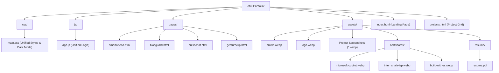

# 🏗️ Project Architecture & Structure

This document outlines the technical structure, design system, and asset management for the **Atul Dhanotiya Personal Portfolio**.

---

## 📂 Core Directory Tree

Below is the optimized, production-ready directory structure. The project uses a zero-build vanilla stack, heavily optimized to reduce HTTP requests.

---

## 🧩 Component Breakdown

| Directory / File | Purpose & Contents | Optimization Note |
| :--- | :--- | :--- |
| **`/` (Root)** | Core routing and documentation. | `index.html` acts as the SPA-like hub. |
| **`css/main.css`** | The singular stylesheet. Contains CSS variables, glassmorphism tokens, Tailwind overrides, keyframe animations, and Dark Mode theme states. | *Merged from 3 files to 1 for performance.* |
| **`js/app.js`** | The singular script. Handles the IntersectionObserver scroll reveals, local storage theme persistence, and project filtering logic. | *Merged from 3 files to 1 for performance.* |
| **`pages/*.html`** | Dedicated case study pages for deep dives into specific projects. | Inherits `main.css` and `app.js` via relative paths. |
| **`assets/`** | Centralized media repository. | All images strictly reference this single source of truth. |

---

## 🎨 Design System Tokens

The project uses CSS Custom Properties to define the theme, allowing for instant Dark/Light mode switching via JavaScript.

### Color Palette
- **Primary Accent**: `#2563eb` (Blue)
- **Primary Gradient**: Linear `135deg, #2563eb, #7c3aed`
- **Glassmorphism Base**: `rgba(255, 255, 255, 0.8)` (Light) / `rgba(15, 23, 42, 0.85)` (Dark)

### Topography & Elements
- **Font**: Google `Inter` (sans-serif)
- **Shadows**: Custom Soft Drop Shadows (`var(--shadow-lg)`)
- **Animations**: `fadeUp`, `fadeLeft`, `fadeRight`, `scaleIn` (Triggered via `IntersectionObserver`)

---

## 🚀 Optimization & SEO Standards

1. **Zero-Build Pipeline**: Pure HTML/CSS/JS means zero compile times and instant CI/CD deployment via GitHub Pages or Vercel.
2. **Open Graph Protocol**: All HTML files feature strict `<meta property="og:...">` tags for beautiful social media previews.
3. **Accessibility (A11y)**: Focus-visible states, ARIA labels, and semantic HTML are implemented across all navigation and interactive components.