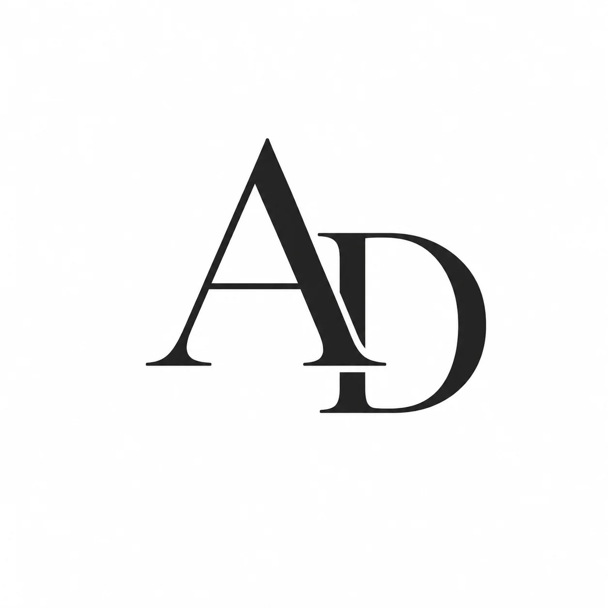

<div align="center">
  
  <h1>Atul Dhanotiya | Portfolio</h1>
  <p><strong>BCA Student • Web Developer • AI Enthusiast</strong></p>

  <p>
    <a href="https://github.com/minegameing50"></a>
    <a href="https://www.linkedin.com/in/atul-dhanotiya-648481356"></a>
  </p>
  
  <p>
    
    
    
    
  </p>
</div>

<br />

A highly optimized, premium personal portfolio website designed to showcase my projects, skills, achievements, and professional experience. Built with a focus on **performance**, **accessibility**, and **modern SaaS-style aesthetics**.

---

## ✨ Key Features

- 🌓 **Dynamic Theme Engine:** Seamless Light/Dark mode toggle with `localStorage` persistence.
- 🧊 **Glassmorphism UI:** Premium frosted-glass navigation and component panels.
- 🚀 **High Performance:** Consolidated CSS and JS for minimal HTTP requests and lightning-fast load times.
- 📱 **Fully Responsive:** Mobile-first design perfectly adapted for phones, tablets, and desktops.
- 🔍 **SEO & Accessibility:** Strict Open Graph metadata, ARIA labels, and keyboard navigation support (`:focus-visible`).
- 🎬 **Micro-Animations:** IntersectionObserver-based scroll reveals and staggered timeline animations.

---

## 🛠️ Technology Stack

This project strictly utilizes a **Zero-Build Vanilla Stack** to ensure maximum longevity and immediate deployment capabilities without relying on Node modules or bundlers.

- **Structure:** HTML5 (Semantic & Accessible)
- **Styling:** CSS3 Custom Properties (Variables), Tailwind CSS (via CDN for layout utilities), FontAwesome (Icons)
- **Logic:** Vanilla JavaScript (ES6+)
- **Typography:** Google Fonts (Inter)

---

## 🚀 Getting Started (Local Development)

Because this project uses a vanilla stack, running it locally is incredibly simple.

1. **Clone the repository:**
   ```bash
   git clone https://github.com/minegameing50/portfolio.git
   cd portfolio
   ```

2. **Run the site:**
   - Simply double-click `index.html` to open it in your browser.
   - *Alternative:* Use VS Code's "Live Server" extension for hot-reloading.

---

## 📂 Project Architecture

The file structure is optimized for production. For a deep dive into the architecture, view the [PROJECT_STRUCTURE.md](PROJECT_STRUCTURE.md) file.

- **`index.html`**: The main landing page featuring the Hero, Timeline, Featured Projects, and Contact sections.
- **`projects.html`**: A filterable grid hub of all projects.
- **`pages/`**: Dedicated case study pages for individual projects (e.g., SmartAttend, BiasGuard AI).
- **`css/main.css`**: The unified, master stylesheet.
- **`js/app.js`**: The unified logic controller.
- **`assets/`**: Centralized repository for all images and PDFs.

---

## 🏆 Featured Highlights

1. **Google Solution Challenge 2026**: Reached the Top 120 Teams globally with *BiasGuard AI*.
2. **Internshala Student Partner**: Actively engaged in campus marketing and technical advocacy.
3. **SmartAttend**: Designed an AI-powered attendance system scaling across universities.

---

## 📫 Contact & Links

I am currently open for internships and collaborative opportunities!

- **Email**: [atuldhanotiya7@gmail.com](mailto:atuldhanotiya7@gmail.com)
- **LinkedIn**: [Atul Dhanotiya](https://www.linkedin.com/in/atul-dhanotiya-648481356)
- **GitHub**: [minegameing50](https://github.com/minegameing50)

---

<div align="center">
  <p>Built with ❤️ using HTML, CSS & JavaScript</p>
  <p>&copy; 2026 Atul Dhanotiya</p>
</div>
